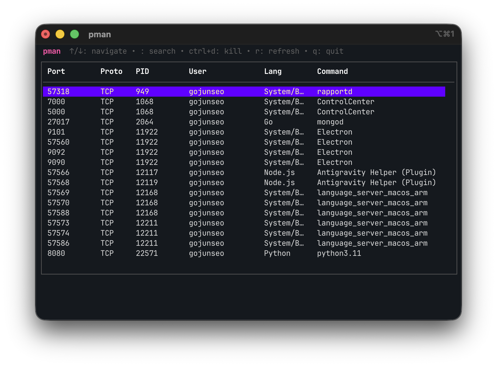
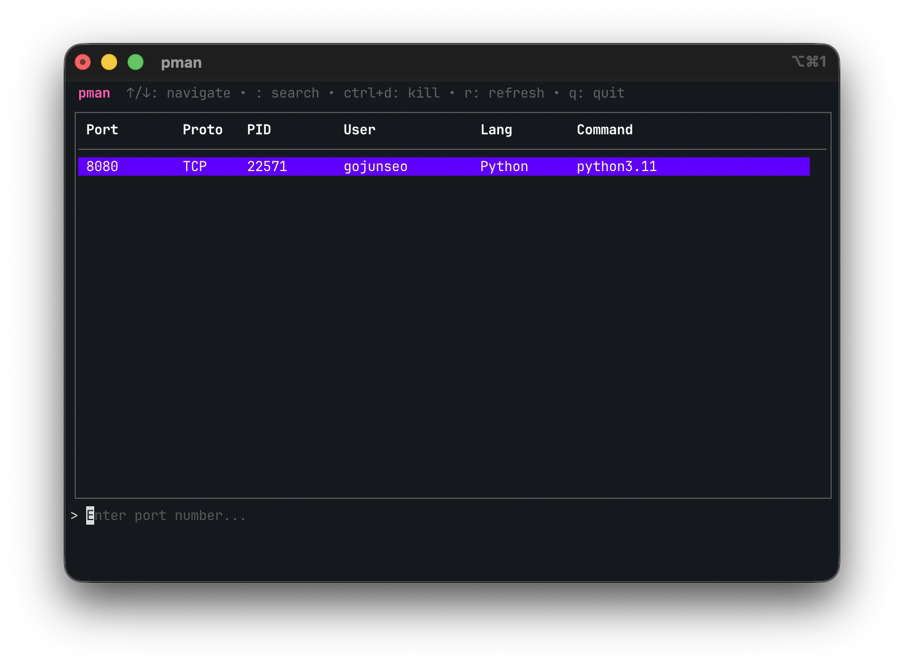
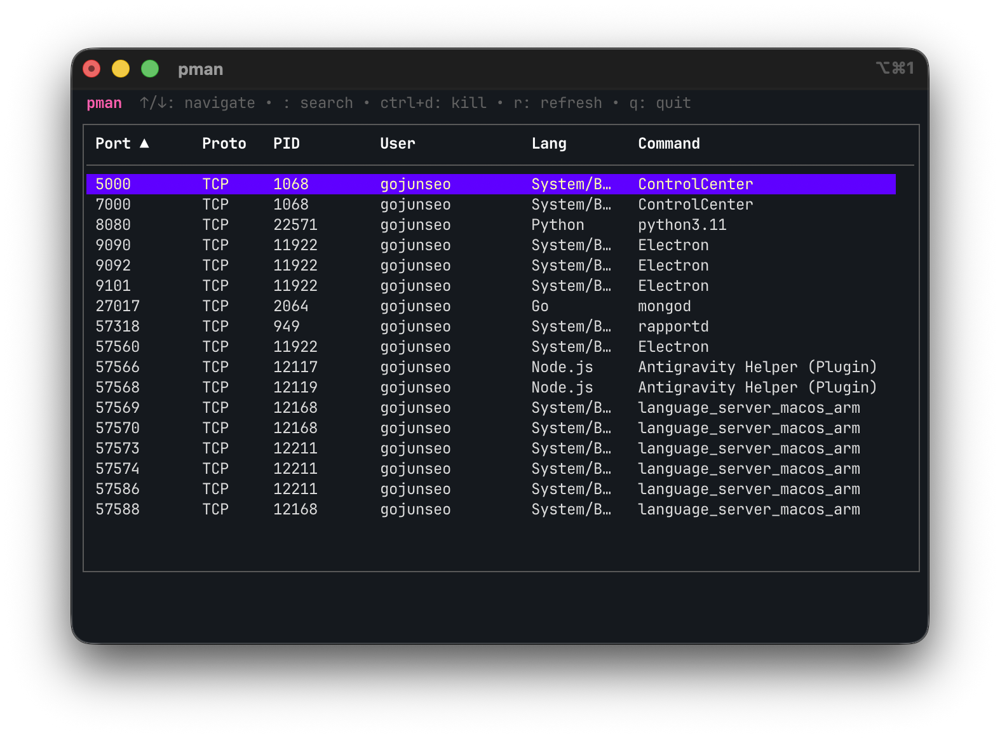
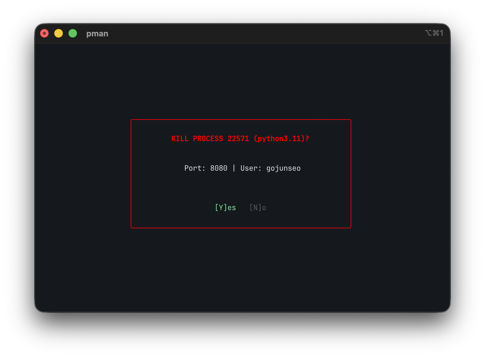

# pman

> **A modern, interactive terminal-based port manager for macOS and Linux.**



`pman` (Port Manager) is a lightweight TUI (Terminal User Interface) tool designed to help developers easily manage listening ports and processes. Built with [Bubble Tea](https://github.com/charmbracelet/bubbletea), it offers a snappy and beautiful interface to view, search, sort, and kill processes directly from your terminal.

## ✨ Features

-   **👀 Visual Process Monitoring**: See all listening ports, protocols, PIDs, users, and commands at a glance.
-   **🔍 Interactive Search**: Quickly filter processes by port number using the built-in search bar.
-   **↕️ Sorting**: Click on column headers to sort by Port, PID, User, or Command.
-   **💀 Safe Process Termination**: Kill processes with `Ctrl+d` (includes a safety confirmation modal).
-   **🧠 Smart Heuristics**: Automatically detects and labels process languages (Python, Node.js, Go, Java, etc.).
-   **🖱️ Mouse Support**: Full mouse support for navigation and sorting.

## 📸 Screenshots

| Search | Sort | Kill |
| :---: | :---: | :---: |
|  |  |  |

## 🚀 Installation

### Download Binary
Download the latest binary for your OS (macOS/Linux) from the [Releases](https://github.com/YOUR_USERNAME/portmanager/releases) page.

```bash
# Example for macOS (Apple Silicon)
tar -xvf pman_Darwin_arm64.tar.gz
sudo mv pman /usr/local/bin/
```

### Build from Source
Requirements: Go 1.21+

```bash
git clone https://github.com/YOUR_USERNAME/portmanager.git
cd portmanager
go build -o pman main.go
sudo mv pman /usr/local/bin/
```

## 🎮 Usage

Run `pman` in your terminal:

```bash
pman
# or with sudo to see all system processes
sudo pman
```

### Keybindings

| Key | Action |
| :--- | :--- |
| `↑` / `↓` | Navigate the list |
| `:` | Open search bar |
| `Enter` | Confirm search filter |
| `Esc` | Clear filter / Cancel modal |
| `Ctrl+d` | Kill selected process |
| `r` | Refresh list manually |
| `q` | Quit |
| **Click** | Sort by column |

## 🛠️ Built With

-   [Go](https://go.dev/)
-   [Bubble Tea](https://github.com/charmbracelet/bubbletea)
-   [Lip Gloss](https://github.com/charmbracelet/lipgloss)
-   [gopsutil](https://github.com/shirou/gopsutil)

## 📄 License

This project is licensed under the MIT License.
